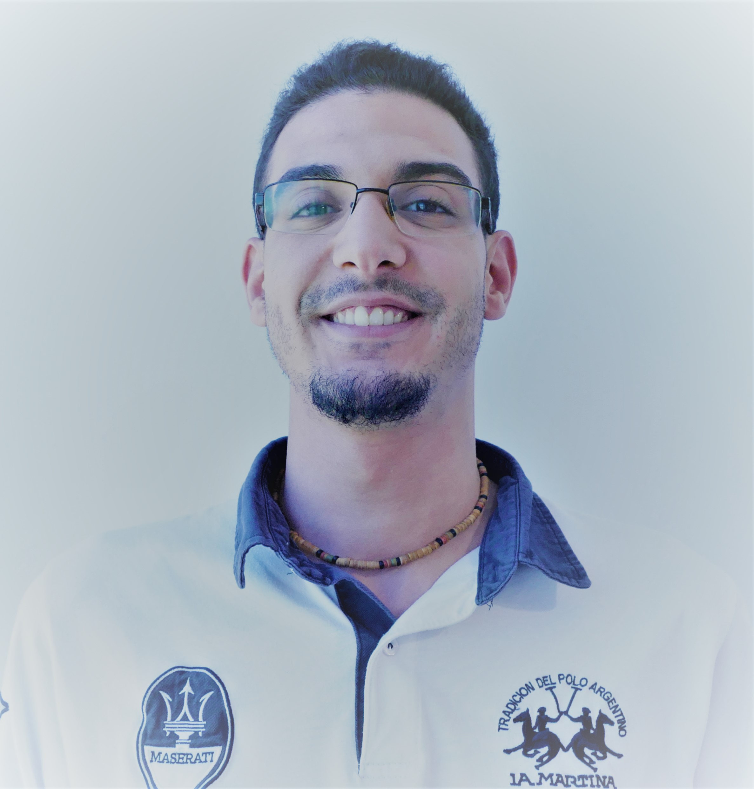

<h2> Hi there 👋, I'm Amin Chouaibi </h2>

 

<p><em>Senior technician in multiplatform development<a href="https://mataro.escolapia.cat/etapes/formacio-professional/grau-superior/dam/"> Escola Pia Santa Anna Mataró</a>
</br>Software Development Enginner at<a href="https://www.plainconcepts.com/"> Plain Concepts</a>
</em></p>

### A little more about me...
```javascript
const Amin = {
  code: [C#, Javascript, Html, Sql],
  tools: [React, Node, NETCore, MongoDB, SQLServer],
  cloud: [Azure, Heroku]
  ID: [Visual Studio, VSCode, ],
  architecture: ["microservices", "event-driven", "domain driven design paradigm"],
  projects: 
}
```

```cs
dynamic Amin = new
{
    Code = new List<string> { "Javascript", "HTML", "C#", "SQL" },
    Tools = new List<string> { "React", "Node", "NETCore", "MongoDB", "Terraform", },
    Cloud = new List<string> { "Azure", "Heroku" },
    IDEs = new List<string> { "VSCode", "Visual Studio" },
    Architectures = new List<string> { "microservices", "event-driven", "domain driven design paradigm" },
};
```
